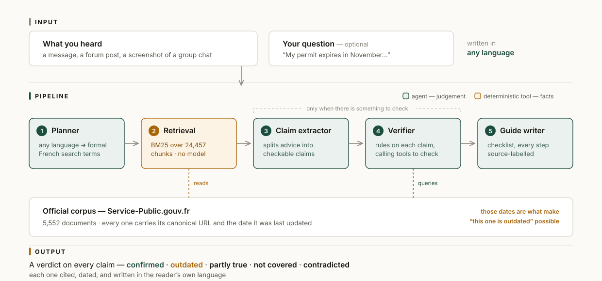

# Hearsay

> **Checks the paperwork advice international students pass around against dated official
> French sources — and tells you exactly what changed.**

[](./LICENSE)
[](https://strandsagents.com/)
[](https://aws.amazon.com/bedrock/)

Every international student in France has a senior who helped them — someone who had been
through it and told them which documents to bring and how early to book. That advice is
generous, specific, and usually from last year.

French administrative rules change constantly. Forum posts don't. So advice keeps
circulating long after it stopped being true, and getting it wrong can cost you your legal
status. The gap isn't that official information doesn't exist — it's that nobody reads it.
People use each other instead.

**Hearsay doesn't tell you to stop asking your friends. It tells you which parts of what
they said are still true.**

---

## What it does

Paste what you heard. Hearsay splits it into individually checkable claims, searches the
official French corpus for each one, and rules on it — with the source and the date that
source was last updated.

```
STALE   OUTDATED                                   confidence: high
        "If your récépissé expires before the new card arrives, just walk
         into the préfecture and they'll extend it."

        Walk-in extension is no longer the route in most préfectures —
        renewal requests now run through the ANEF online platform, and the
        official document covering récépissés was revised after this advice
        was written.

        F15763 · Qu'est-ce qu'un récépissé de demande de titre de séjour
        last updated 2023-11-17

GAP     NOT COVERED                                confidence: high
        "You need to show at least €3,000 in your bank account."

        Official documents set no specific balance for a student permit
        renewal. F2231 requires proof of "sufficient means" without naming
        a figure. This number likely comes from one préfecture in one year
        and should not be treated as a general requirement.

        F2231 · Étudiant étranger en France : visa de long séjour ou titre de séjour
        last updated 2026-08-01
```

Five verdicts are possible:

| Verdict | Meaning |
| --- | --- |
| **Confirmed** | Official sources support this |
| **Outdated** | It was true once — the rules changed after this advice was written |
| **Partly true** | Broadly right, but a specific detail is wrong |
| **Not covered** | Official documents are silent on this situation |
| **Contradicted** | Official sources say the opposite |

Alongside the verdicts, Hearsay produces an actionable checklist — and labels every step as
coming from official sources, community advice, or both.

Leave the paste box empty and it simply answers your question.

### Two commitments

**It answers in your language.** You write in English, Chinese, Spanish, Arabic — the answer
comes back in the same language, while retrieval always runs through formal French, because
that is what the corpus is written in. The language barrier is a large part of why students
rely on hearsay in the first place.

**"The official documents don't say" is a valid answer.** When the corpus is silent — which
happens constantly for edge cases, and edge cases are exactly when people go looking for
advice — Hearsay returns *not covered* and says to take it to the préfecture. An honest gap
is more useful here than a confident guess.

---

## Architecture

<p align="center">
  
</p>

That green/amber split is the whole design. Retrieval and date arithmetic are plain Python, so every
conclusion traces back to a specific document ID and URL rather than to the model's memory.
For a product whose entire value is trustworthiness, that line is the architecture.

Agents hand structured Pydantic models to each other — not free-form text — via Strands'
`structured_output`, which keeps every stage inspectable and safe to render in a UI.

### Why the planner matters more than it looks

The user writes Chinese; the corpus is French. Translating the question literally retrieves
nothing, because official documents don't use the words people use. `续居留` has to become
`renouvellement titre de séjour étudiant` — the register the government actually writes in.
Making an agent responsible for producing *formal administrative French*, rather than a
translation, is what makes retrieval work at all.

---

## Quick start

Requires Python 3.10+ and AWS credentials with Amazon Bedrock access (model access enabled
for Anthropic Claude).

```bash
git clone https://github.com/alineyyy/Hearsay.git
cd Hearsay
python3 -m venv .venv && source .venv/bin/activate
pip install -r requirements.txt
```

Build the official corpus (the raw data is not committed — 23 MB zipped, 148 MB extracted):

```bash
mkdir -p data
curl -L -o data/service-public.xml \
  "https://www.data.gouv.fr/api/1/datasets/r/0ed10f28-d197-4324-97b3-037f625095ac"
mkdir -p data/spf_raw && unzip -oq data/service-public.xml -d data/spf_raw
python3 src/ingest/parse_spf.py
```

> The file is served with an `.xml` extension but is actually a ZIP of ~5,552 per-fiche XML
> files. This is not a mistake in the command above.

Run the web app:

```bash
python3 serve.py     # http://127.0.0.1:8000
```

Or from the command line:

```bash
python3 run.py verify        # check a sample post, in English
python3 run.py verify-zh     # the same post in Chinese — shows the multilingual path
python3 run.py ask "My student residence permit expires soon. How do I renew it?"
```

A run makes several Bedrock calls and takes a minute or two. The web app streams each
pipeline stage as it executes, so you can watch it work rather than watching a spinner.

---

## Repository layout

```
src/ingest/parse_spf.py     official XML ➜ structured corpus  (run once)
src/retrieval/corpus.py     chunking + BM25 index
src/community/sources.py    pluggable community-source interface
src/agents/schemas.py       Pydantic contracts between pipeline stages
src/agents/tools.py         deterministic tools exposed to the agents
src/agents/pipeline.py      the five-stage orchestration
src/web/                    FastAPI server + single-page front end
run.py                      CLI entry point, with sample material
docs/devpost-story.md       project story
```

### Community sources are pluggable

`src/community/sources.py` abstracts where advice comes from. Pasted text is the primary
implementation — it carries no platform risk and mirrors what students actually do. Adding
a connector for another source means implementing one `fetch()` method; nothing upstream
changes.

Scraping a closed social platform was considered and rejected, for a reason unrelated to
difficulty: it would make a live demo depend on a fight with someone's anti-bot system.

---

## Data

Official corpus: **Service-Public.gouv.fr / DILA**, published on
[data.gouv.fr](https://www.data.gouv.fr/datasets/service-public-fr-guide-vos-droits-et-demarches-particuliers/)
under **Licence Ouverte 2.0 (Etalab)**, which requires naming the source, the download URL
and the file date.

Each document carries `dateDerniereModificationImportante` and a canonical `spUrl`. Those
two fields are what let Hearsay say *"this advice predates a change made on 2026-08-01"*
instead of vaguely warning that rules change. Any transformation of the corpus must
preserve them.

## Scope

Hearsay is built on one pluggable ingredient: a corpus of official documents that carry
update dates. This release ships the **French** corpus — 5,552 documents from
Service-Public.gouv.fr — and is validated in **English and Chinese**. The pipeline itself is
country- and language-agnostic; the same five stages work anywhere an equivalent open
dataset exists.

Hearsay reports what official documents say and when they were last updated. **It is not
legal advice.**

## License

[MIT](./LICENSE)

---

Built with [AWS Strands Agents](https://strandsagents.com/) on Amazon Bedrock for the
[Agents for Humans Hackathon](https://agentsforhumans.devpost.com/).
